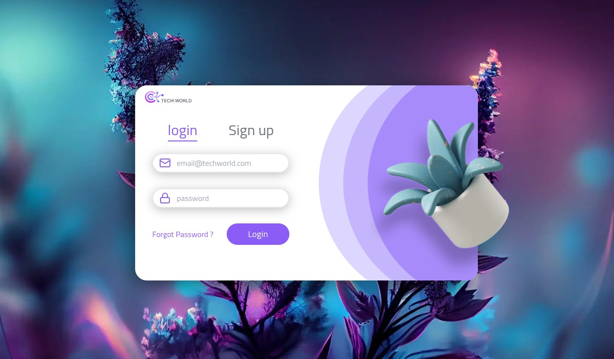

<h1 align="center"> TECH WORLD LOGIN </h1>

   The "Tech World Login" project is a modern web application showcasing a login feature implemented using React.js, Next.js, TypeScript,Tailwind CSS, Node.js and Figma. The application provides a user-friendly login form where users can enter their credentials to access the platform. This project serves as an excellent foundation for building more advanced authentication features in web applications.

  <a href="#-technologies">Technologies</a>&nbsp;&nbsp;&nbsp;|&nbsp;&nbsp;&nbsp;
  <a href="#-project">Project</a>&nbsp;&nbsp;&nbsp;|&nbsp;&nbsp;&nbsp;
  <a href="#-layout">Layout</a>&nbsp;&nbsp;&nbsp;|&nbsp;&nbsp;&nbsp;
  <a href="#memo-license">License</a>

  

   <a href="#to-be-replaced-with-actual-url">To access the Tech World Login page, click here</a>

 

  <!-- To be replaced with actual screenshot -->
  

## 🚀 Technologies

This project was developed with the following technologies:

- React.js
- Next.js
- TypeScript
- Tailwind CSS
- Node.js
- React hook forms
- Zod
- Tostfy
- Figma

## 💻 Project

This project is a modern web application demonstrating the implementation of a secure login feature using React.js, Next.js, TypeScript,Tailwind CSS, Node.js and Figma. The application provides users with an intuitive login form and ensures robust validation to guarantee the security of entered credentials.

## 🔖 Layout

To test the project, you can access it through [THIS LINK](#to-be-replaced-with-actual-url)

## :memo: License

This project is under the MIT license.
---

Made with ♥ by [Your Name]
